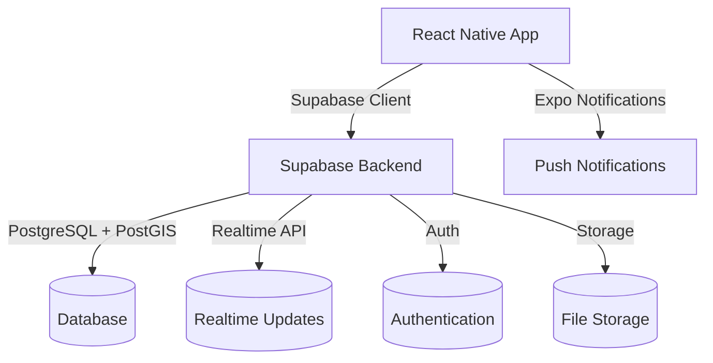

# AlertMy Project Context

## Project Overview
AlertMy is a real-time alert notification system with geospatial capabilities, built with React Native (Expo) and powered by Supabase. The application allows users to report and view real-time incidents with location-based functionality, leveraging PostgreSQL with PostGIS for advanced spatial queries.

## System Architecture



## Mobile App (AlertMy)

### Technology Stack
- **Framework**: React Native (Expo) 49.0.0+
- **State Management**: React Context API & Hooks
- **UI Components**: React Native Paper
- **Navigation**: React Navigation 6.x
- **Database & Auth**: Supabase JS Client
- **Maps & Location**: react-native-maps, expo-location
- **Local Storage**: @react-native-async-storage/async-storage
- **Notifications**: Expo Notifications
- **HTTP Client**: Axios
- **Environment**: react-native-config

### Project Structure
```
app/
├── components/        # Reusable UI components
│   ├── AlertCard.tsx  # Card component for displaying alerts
│   ├── AlertForm.tsx  # Form for creating/editing alerts
│   └── Avatar.tsx     # User avatar component
├── navigation/        # Navigation configuration
│   ├── AppNavigator.tsx  # Main app navigation
│   └── AuthNavigator.tsx # Authentication flows
├── screens/           # App screens
│   ├── AlertDetailScreen.tsx  # Detailed view of an alert
│   ├── AlertsListScreen.tsx   # List of nearby alerts
│   └── CreateAlertScreen.tsx  # Create new alert
├── services/          # API and service integrations
│   ├── supabase.ts    # Supabase client configuration
│   ├── alerts.ts      # Alert-related API calls
│   ├── auth.ts        # Authentication services
│   └── location.ts    # Location services
├── hooks/             # Custom React hooks
│   ├── useAuth.ts     # Authentication state
│   └── useLocation.ts # Location tracking
└── utils/             # Utility functions
    ├── helpers.ts     # Helper functions
    └── types.ts       # TypeScript type definitions
```

## Backend (Supabase)

### Core Features
- **Authentication**: Built-in user management with JWT
- **Database**: PostgreSQL 14+ with PostGIS extension
- **Realtime**: Real-time subscriptions for live updates
- **Storage**: File storage with access controls
- **Edge Functions**: Serverless functions for custom logic

### Database Schema

#### Users
- `id` - UUID (Primary Key)
- `email` - string (Unique)
- `created_at` - timestamp
- `updated_at` - timestamp

#### Alerts
- `id` - UUID (Primary Key)
- `user_id` - UUID (Foreign Key to users)
- `title` - string
- `description` - text
- `location` - geography(Point, 4326)
- `category` - string
- `status` - enum('active', 'resolved', 'false_alarm')
- `created_at` - timestamp
- `updated_at` - timestamp

#### User Locations
- `id` - UUID (Primary Key)
- `user_id` - UUID (Foreign Key to users)
- `location` - geography(Point, 4326)
- `last_updated` - timestamp

### Security
- Row Level Security (RLS) for all tables
- JWT authentication with custom claims
- Rate limiting on API endpoints
- CORS configuration

## Development Setup

### Prerequisites
- Node.js 18+
- npm 9+ or yarn 1.22+
- Expo CLI (`npm install -g expo-cli`)
- Supabase CLI (`npm install -g supabase`)
- Git

### Environment Variables
Create a `.env` file in the project root with:
```env
EXPO_PUBLIC_SUPABASE_URL=your-supabase-url
EXPO_PUBLIC_SUPABASE_ANON_KEY=your-anon-key
GOOGLE_MAPS_API_KEY=your-google-maps-api-key
```

### Running Locally
1. Install dependencies:
   ```bash
   npm install
   # or
   yarn
   ```

2. Start the development server:
   ```bash
   npx expo start
   ```

3. Run on iOS/Android:
   - iOS: Press `i` in the terminal
   - Android: Press `a` in the terminal

## Deployment

### Building for Production
1. Create production build:
   ```bash
   npx expo prebuild
   ```

2. Build for specific platforms:
   ```bash
   # iOS
   npx expo run:ios
   
   # Android
   npx expo run:android
   ```

### App Store Submission
- iOS: Use `eas build` and submit to App Store Connect
- Android: Generate APK/AAB and upload to Google Play Console

### Supabase Deployment
1. Link your project:
   ```bash
   supabase link --project-ref your-project-ref
   ```

2. Apply database migrations:
   ```bash
   supabase db push
   ```

## Monitoring & Analytics
- **Crash Reporting**: Sentry or Firebase Crashlytics
- **Analytics**: Supabase Analytics or PostHog
- **Performance**: React Native Performance Monitor

## Future Enhancements
- Push notifications for nearby alerts
- Offline support with local database sync
- User profiles with avatars
- Advanced filtering and search for alerts
- Social features (likes, comments, sharing)
- Integration with emergency services

## Troubleshooting
- **iOS Build Issues**: Run `pod install` in the `ios` directory
- **Android Build Issues**: Ensure Android SDK and build tools are properly configured
- **Supabase Connection**: Verify environment variables and network connectivity
- **Realtime Issues**: Check Supabase project settings and RLS policies

## Support
For support, please open an issue in the GitHub repository or contact the development team.
