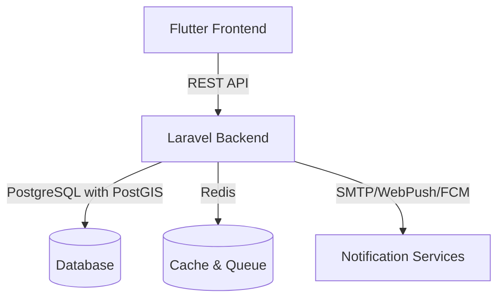

# AlertMy Project Context

## Project Overview
AlertMy is a comprehensive alert notification system with geospatial capabilities, featuring a Flutter frontend and a Laravel API backend with PostgreSQL and PostGIS for location-based functionality.

## System Architecture



## Frontend (alertmy_fe)

### Technology Stack
- **Framework**: Flutter 3.0+
- **State Management**: Provider/Riverpod
- **HTTP Client**: `http` package with Dio for advanced features
- **Maps & Location**: `google_maps_flutter` and `location` packages
- **Local Notifications**: `flutter_local_notifications`
- **Local Storage**: `shared_preferences` and `hive`

### Project Structure
```
lib/
├── core/               # Core functionality
│   ├── constants/     
│   ├── errors/        
│   ├── services/      
│   └── utils/         
├── features/          # Feature-based modules
│   ├── auth/         
│   ├── alerts/       
│   └── profile/      
├── shared/            # Shared widgets and utilities
│   ├── widgets/      
│   └── theme/        
└── main.dart         # Application entry point
```

## Backend (alertmy-be)

### Technology Stack
- **Framework**: Laravel 10.x
- **Database**: PostgreSQL 14+ with PostGIS 3.0+
- **API**: RESTful with JSON:API specification
- **Authentication**: Laravel Sanctum for SPA authentication
- **Spatial Data**: `grimzy/laravel-mysql-spatial` for PostGIS integration
- **Caching**: Redis
- **Queue**: Laravel Horizon with Redis

### Project Structure
```
app/
├── Console/          # Artisan commands
├── Http/            
│   ├── Controllers/  # API Controllers
│   ├── Middleware/   
│   └── Requests/     # Form Requests
├── Models/           # Eloquent Models
├── Policies/         # Authorization Policies
└── Services/         # Business Logic

database/
├── factories/       # Model Factories
├── migrations/      # Database Migrations
├── seeders/         # Database Seeders
└── spatial/         # PostGIS specific migrations

routes/
├── api.php         # API Routes
└── web.php         # Web Routes
```

## Database Schema

### Key Tables
- `users` - User accounts and authentication
- `alerts` - Alert notifications
- `locations` - Geospatial data with PostGIS
- `devices` - For push notifications
- `notifications` - System notifications

### PostGIS Integration
- Spatial columns for location-based queries
- Geofencing capabilities
- Distance calculations
- Spatial indexing for performance

## Development Setup

### Prerequisites

#### Frontend
- Flutter SDK 3.0.0 or later
- Android Studio / Xcode (for mobile builds)
- Chrome (for web development)
- Android SDK / Xcode Command Line Tools

#### Backend
- PHP 8.1+
- Composer 2.0+
- PostgreSQL 14+ with PostGIS 3.0+
- Redis 6.0+
- Node.js 16+ (for asset compilation)

### Environment Setup

#### Frontend (alertmy_fe)
1. Copy `.env.example` to `.env` and configure:
   ```
   API_BASE_URL=http://localhost:8000/api
   GOOGLE_MAPS_API_KEY=your_api_key
   ```

2. Install dependencies:
   ```bash
   flutter pub get
   ```

3. Run the development server:
   ```bash
   flutter run -d chrome --web-port=3000
   ```

#### Backend (alertmy-be)
1. Copy `.env.example` to `.env` and configure:
   ```
   DB_CONNECTION=pgsql
   DB_HOST=127.0.0.1
   DB_PORT=5432
   DB_DATABASE=alertmy
   DB_USERNAME=postgres
   DB_PASSWORD=
   
   # PostGIS Configuration
   DB_POSTGRES_SCHEMA=public
   
   # Redis
   REDIS_HOST=127.0.0.1
   REDIS_PASSWORD=null
   REDIS_PORT=6379
   ```

2. Install dependencies:
   ```bash
   composer install
   ```

3. Generate application key:
   ```bash
   php artisan key:generate
   ```

4. Install and enable PostGIS extension:
   ```sql
   CREATE EXTENSION IF NOT EXISTS postgis;
   ```

5. Run migrations and seeders:
   ```bash
   php artisan migrate --seed
   ```

6. Start the development server:
   ```bash
   php artisan serve --host=0.0.0.0 --port=8000
   ```

## Development Workflow

### Frontend Development
- Use feature branches for new development
- Follow BLoC pattern for state management
- Write widget tests for all new components
- Use `flutter analyze` before committing

### Backend Development
- Follow RESTful API design principles
- Use Form Requests for validation
- Implement API Resource classes for consistent JSON responses
- Write feature tests for all API endpoints
- Use database transactions in tests

### Spatial Data Handling
- Use `ST_MakePoint` for storing coordinates
- Implement spatial scopes for common queries
- Use spatial indexes for performance
- Example query:
  ```php
  $locations = Location::whereDistance('coordinates', $point, 1000) // Within 1km
      ->orderByDistance('coordinates', $point, 'asc')
      ->get();
  ```

## Testing

### Frontend Tests
- Unit tests: `flutter test`
- Widget tests: `flutter test test/widget_test.dart`
- Integration tests: `flutter drive --target=test_driver/app.dart`
- Coverage: `flutter test --coverage`

### Backend Tests
- Unit tests: `php artisan test --testsuite=Unit`
- Feature tests: `php artisan test --testsuite=Feature`
- API tests: `php artisan test --testsuite=Feature --filter=ApiTest`
- Coverage: `XDEBUG_MODE=coverage php artisan test --coverage-html=coverage`

## Deployment

### Frontend Deployment
1. Build for production:
   ```bash
   flutter build web --release --web-renderer html
   ```
2. Deploy the contents of `build/web` to your web server

### Backend Deployment
1. Install production dependencies:
   ```bash
   composer install --optimize-autoloader --no-dev
   ```
2. Optimize configuration:
   ```bash
   php artisan config:cache
   php artisan route:cache
   php artisan view:cache
   ```
3. Set up queue workers:
   ```bash
   php artisan queue:work --daemon
   ```
4. Configure your web server (Nginx/Apache) to point to the `public` directory

## Monitoring and Maintenance

### Logging
- Laravel Logs: `storage/logs/laravel.log`
- Error Tracking: Configure with Sentry/Bugsnag
- Query Logging: Enable in development for debugging

### Performance
- Use Laravel Telescope for local development
- Implement Redis caching for frequently accessed data
- Optimize database queries with eager loading
- Use database indexes for frequently queried columns

## Security Considerations

### Frontend
- Implement proper input validation
- Use HTTPS for all API calls
- Store sensitive data securely using `flutter_secure_storage`
- Implement proper error handling

### Backend
- Use Laravel's built-in CSRF protection
- Implement rate limiting for API endpoints
- Sanitize all user inputs
- Use prepared statements for database queries
- Regularly update dependencies

## Troubleshooting

### Common Issues
1. **PostGIS extension not found**:
   ```bash
   sudo apt-get install postgis postgresql-14-postgis-3
   ```
   Then in psql:
   ```sql
   CREATE EXTENSION postgis;
   ```

2. **Missing PHP extensions**:
   ```bash
   sudo apt-get install php8.1-pgsql php8.1-xml php8.1-mbstring
   ```

3. **Flutter web build issues**:
   ```bash
   flutter clean
   flutter pub get
   flutter create .
   ```

## Resources
- [Flutter Documentation](https://flutter.dev/docs)
- [Laravel Documentation](https://laravel.com/docs)
- [PostGIS Documentation](https://postgis.net/documentation/)
- [Laravel Sanctum](https://laravel.com/docs/sanctum)
- [Flutter Google Maps](https://pub.dev/packages/google_maps_flutter)
